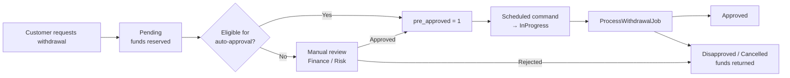

# Betsson Backend Test

A Laravel 13 / PHP 8.5 API that manages customers, their wallets, deposits and withdrawals, and a settlement report — built as a backend take-home test.

Application data access goes through raw PDO statements (no Eloquent/query builder), with row-level locking (`SELECT ... FOR UPDATE`) used to make webhook and job processing idempotent under concurrent calls. `Illuminate\Database\ConnectionInterface` is used purely for transaction demarcation.

## Requirements

- [Docker](https://www.docker.com/) (used to run [Laravel Sail](https://laravel.com/docs/sail): PHP 8.5, MySQL 8.4, Redis)
- Composer (only needed on the host to run `composer install` before Sail exists; if you don't have PHP/Composer locally, see the "No local PHP" note below)

## Getting Started

1. Clone the repository and move into it:

   ```bash
   git clone <repository-url> betsson-backend-test
   cd betsson-backend-test
   ```

2. Install PHP dependencies:

   ```bash
   composer install
   ```

   **No local PHP?** Use a throwaway container instead:

   ```bash
   docker run --rm \
       -u "$(id -u):$(id -g)" \
       -v "$(pwd):/var/www/html" \
       -w /var/www/html \
       laravelsail/php85-composer:latest \
       composer install --ignore-platform-reqs
   ```

3. Copy the environment file:

   ```bash
   cp .env.example .env
   ```

4. Point it at the services Sail's `compose.yaml` provides (the defaults are SQLite; the locking/concurrency design here is MySQL-specific, so use MySQL):

   ```dotenv
   DB_CONNECTION=mysql
   DB_HOST=mysql
   DB_PORT=3306
   DB_DATABASE=laravel
   DB_USERNAME=sail
   DB_PASSWORD=password
   ```

5. Start the containers:

   ```bash
   ./vendor/bin/sail up -d
   ```

6. Generate the app key and run migrations:

   ```bash
   ./vendor/bin/sail artisan key:generate
   ./vendor/bin/sail artisan migrate
   ```

7. (Optional) Seed sample data — 50 customers, each with approved deposits and withdrawals:

   ```bash
   ./vendor/bin/sail artisan db:seed
   ```

The API is now available at `http://localhost/api/v1`.

### Running the scheduler and queue

Withdrawals move from `Pending` to `Approved` via a scheduled command plus a queued job, not synchronously. In development, run:

```bash
./vendor/bin/sail composer dev
```

This starts the app server, queue worker, scheduler (`schedule:work`), log tailing (Pail), and Vite together. Without it, `withdrawals:process-pending` (which runs every 5 minutes, see `routes/console.php`) and its `ProcessWithdrawalJob` jobs won't actually fire.

## Running Tests

```bash
./vendor/bin/sail composer test
```

This runs, in order: Pint + Rector (`test:lint`), PHPStan at max strictness (`test:types`), 100% type coverage (`test:type-coverage`), and the full Pest suite with a 100% line-coverage gate (`test:unit`).

Individual steps:

```bash
./vendor/bin/sail composer test:unit           # Pest, Unit + Feature + Browser, 100% coverage required
./vendor/bin/sail composer test:types          # PHPStan (Larastan)
./vendor/bin/sail composer test:type-coverage  # Pest type coverage
./vendor/bin/sail pint                         # Fix code style
```

A separate suite proves row-locking is safe under real concurrent processes (via `pcntl_fork`). It's excluded from `composer test` because forking inside a live test-runner TUI can corrupt the terminal, so it's run on its own:

```bash
./vendor/bin/sail composer test:concurrency
```

## API Overview

All routes are prefixed with `/api/v1`.

| Method | URI | Description |
|---|---|---|
| POST | `/customers` | Create a customer (also creates their wallet) |
| GET | `/customers/{customer}` | Show a customer |
| PUT/PATCH | `/customers/{customer}` | Update a customer |
| GET | `/customers/{customer}/deposits` | List a customer's deposits |
| POST | `/customers/{customer}/deposits` | Create a pending deposit |
| POST | `/deposits/{deposit}/webhook` | Payment gateway webhook — approves/disapproves a deposit (idempotent) |
| GET | `/customers/{customer}/withdrawals` | List a customer's withdrawals |
| POST | `/customers/{customer}/withdrawals` | Create a withdrawal (reserves the balance immediately) |
| GET | `/reports/deposits-withdrawals` | Paginated report of approved deposits/withdrawals, grouped by settlement date and country |

## Withdrawal Processing Flow

Withdrawals are processed asynchronously. A customer's request is accepted immediately, but the payout itself is carried out later by a scheduled command and a queued job, and only once the withdrawal has cleared an approval gate represented by the `pre_approved` flag.

### Lifecycle

1. **Request (`Pending`)** — The customer submits a withdrawal via `POST /customers/{customer}/withdrawals`. The wallet row is locked, the balance is checked, and the amount is **reserved (debited) immediately**, so the balance can never go below zero and the same funds cannot be withdrawn twice. The withdrawal is stored as `Pending` with `pre_approved = 0`.
2. **Approval gate (`pre_approved = 1`)** — A withdrawal is only eligible for payout once it has been pre-approved. This is the point where the business decides whether the request is safe to pay out (see *Approval Paths* below).
3. **Pickup (`InProgress`)** — The `withdrawals:process-pending` command runs every 5 minutes, moves eligible withdrawals to `InProgress`, and dispatches one `ProcessWithdrawalJob` per withdrawal.
4. **Processing (`Approved` / `Disapproved`)** — The job finalizes the withdrawal (in a real system, this is where the payment provider would be called) and records `processed_at`. Approved withdrawals then appear in the settlement report.
5. **Cancellation (`Cancelled`)** — Before processing, a withdrawal may be cancelled by the customer or by an operator, in which case the reserved amount is returned to the wallet.



### Approval Paths

In a production system, `pre_approved` is the single switch that separates "requested" from "cleared for payout". It can be set in two ways:

- **Automatic approval** — The customer meets the criteria for straight-through processing: their KYC documents have been submitted and verified, their profile is validated, and the request falls within configured limits (e.g. amount thresholds, withdrawal frequency, no open risk or AML flags). These withdrawals are pre-approved without human involvement and are paid out on the next scheduler run.
- **Manual approval** — Any withdrawal that does not qualify for automatic approval (unverified account, missing documents, large amount, unusual activity, first withdrawal to a new payment method, etc.) stays `Pending` until a member of the Finance/Risk department reviews it. The reviewer either pre-approves it, releasing it to the automated pipeline, or rejects it, returning the reserved funds to the customer.

In both cases the actual payout remains fully automated: the command and job only ever act on withdrawals that have already been pre-approved, which keeps the decision ("should we pay this?") cleanly separated from the execution ("pay it").

> **Note on this implementation:** to keep the scope of the test focused, there is no eligibility engine, back-office approval endpoint, or cancellation endpoint. The scheduled command currently treats every `Pending` withdrawal as eligible and sets `pre_approved = 1` itself, and the job always finalizes to `Approved`. Introducing the approval paths above would mean restricting the command to rows where `pre_approved = 1`, and setting that flag from an eligibility check at creation time or from a Finance approval action.

### Reliability Guarantees

- **No double spending** — The wallet row is locked (`SELECT ... FOR UPDATE`) while the balance is checked and debited.
- **No duplicate processing** — `ProcessWithdrawalJob` implements `ShouldBeUnique`, and `WithdrawalService::approve()` locks the withdrawal row and re-checks its status and `pre_approved` flag, so a retried or duplicated job is a no-op.
- **Retries** — The job is retried up to 3 times with a 60-second backoff on transient failures.

## Tech Stack

- PHP 8.5, Laravel 13
- MySQL 8.4 (via Sail), Redis
- Pest 5 (+ type coverage plugin), Larastan 3, Pint, Rector
- GitHub Actions CI (mirrors the local Sail/MySQL setup)
